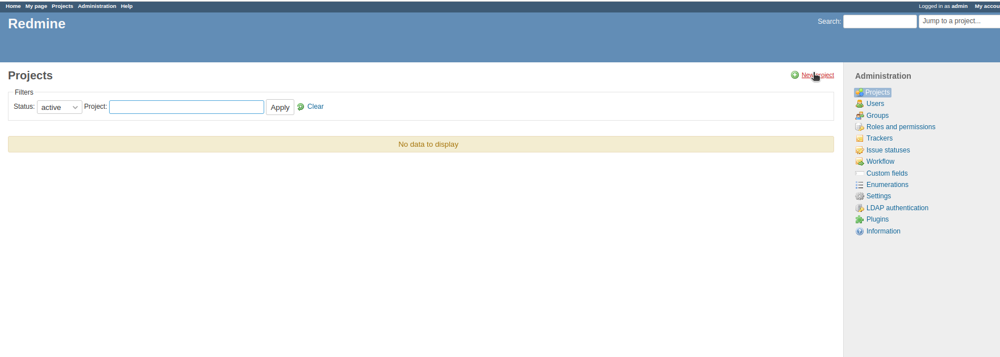
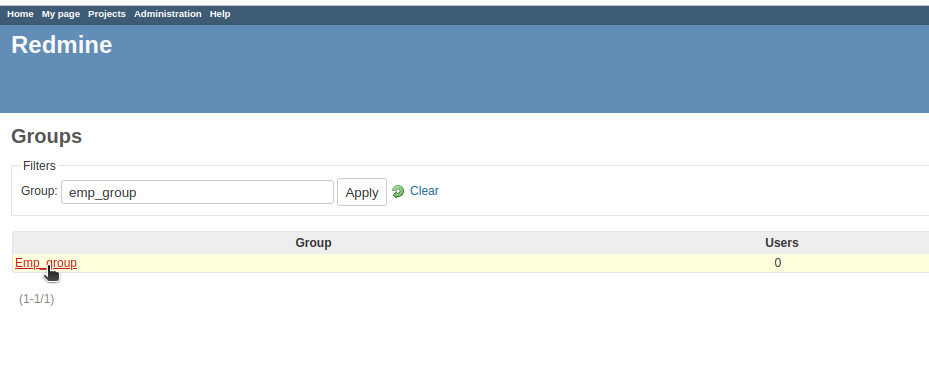
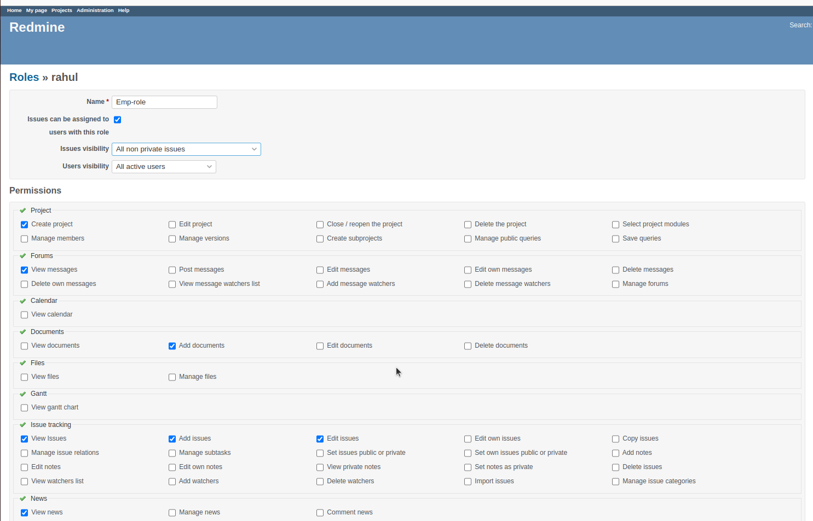

 

# 1. Install and configure redmine on Podman 

#Create a folder for PostgreSQL data
echo "Creating folder for PostgreSQL data..."
mkdir -p /home/rahul/data/redmine/postgres

## Change ownership of the folder
echo "Changing ownership of the folder..."
podman unshare chown 999:999 /home/rahul/data/redmine/postgres

## Create the Redmine Pod
echo "Creating the Redmine Pod..."
podman pod create --name redmine --publish 3100:3000 --publish 5432:5432

## Run the PostgreSQL container
echo "Running the PostgreSQL container..."
podman run -dt \
    --pod redmine \
    --name redmine-postgres \
    -e POSTGRES_DB=support \
    -e POSTGRES_USER=postgres \
    -e POSTGRES_PASSWORD=password \
    -e POSTGRES_HOST_AUTH_METHOD=trust \
    -e PGDATA=/var/lib/postgresql/data/pgdata \
    -v /home/rahul/data/redmine/postgres:/var/lib/postgresql/data \
  docker.io/postgres:latest

## Run the Redmine application container
echo "Running the Redmine application container..."
podman run -dt \
    --pod redmine \
    --name redmine-app \
    -e REDMINE_DB_POSTGRES=127.0.0.1 \
    -e REDMINE_DB_PORT=5432 \
    -e REDMINE_DB_DATABASE=support \
    -e REDMINE_DB_USERNAME=postgres \
    -e REDMINE_DB_PASSWORD=password \
    docker.io/redmine:latest

## Open Redmine in the default web browser
echo "Opening Redmine in the web browser..."

xdg-open http://localhost:3100

------------------------------------------------------------------------

# 2. Create multiple Project.

Login redmine account.

User:  admin
Password: admin

### Then, Click on Administration tab.

### Then, Click on Project icon.

### Then, Click on New-Project icon.

### Then, Open New-Project page.

##### Name:  Enter the project name here....  

##### Description:  Enter the Description here......

##### Click on "Create buttion"/ "Create and add another".

<!--  -->

### Then, Click on Project tab.
##### Here all the list of projects.

# 3. Create user and assign to emp-group.

### Click on Administration tab.
### Click on "User" icon.

### Then, Click on "New-user" icon.

### Here open new-user page.

#####  Login :  Enter user-login(E-mail)
##### First name : Enter the name here..
##### Last name : Enter the last name here..
##### Email :  Enter the Email id here..
##### Language: Select Language here..

##### Password : Enter password here....
##### Confirmation : Enter the Re-Password here..

##### Must change password at next logon: Mark this opcation...

##### Click on Create buttion.

# Now, assign to emp-group.

### Click on "Groups" icon.

### Then, Click on "New-Group" icon.

### Then, open  New group page.

##### Name : Enter the gorup name here...

##### Click on "Create" buttion.

### Then, Click on Group icon.
##### then, Click on "Group name" from list.

### Then, Click on "User" tab.

### Then, Click on "New user".

### Now, Select the user here.
### Then, Click on add buttion.

<!--  -->

<!--  -->

<!--  -->

# 4. Create role emp-role and to emp-tracker 

### Click on "Roles and perrmission".

### Then, Click on "New role".

### Now, open New role page here .
### Then, save the page.

# Crete Trackers(emp-tracker).

### Click on "Trackers". 

### Then click on "New tracker".

##### Name: Enter the "tracker name".....  
##### Default status: Select the status here....
##### Description : Enter the description here.....

##### Project: Select the project from list here. 

##### Click on "Create" buttion.

###### But here Default status: Empty

###### Now, we need to create status

### Click on " Issue statues ".
### Then Click on "New-Issue" buttion.
### Then Open New issue page here.

  

# 5. Create workflow.

### Click on "workflow ".

### Now, Select the "Role" and "Tracker" here.
### Then, Click on "Edit" buttion.

### Then, Open Workflow page.

##### New-> In Progress -> Resolved -> Closed
#####      In Progress -> Reject 
#####      In progress -> Hold 

##### Then, click on "Save" buttion.

 

 

